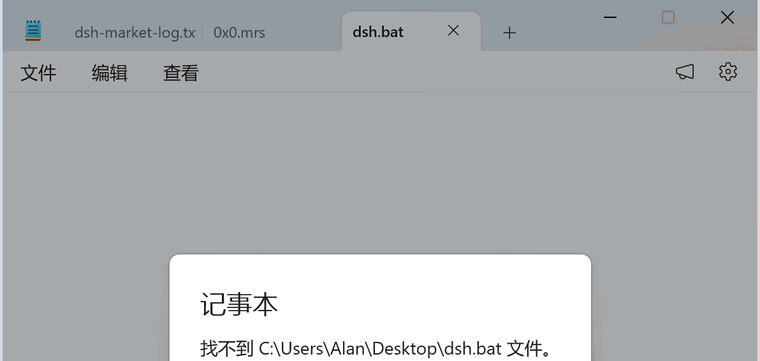
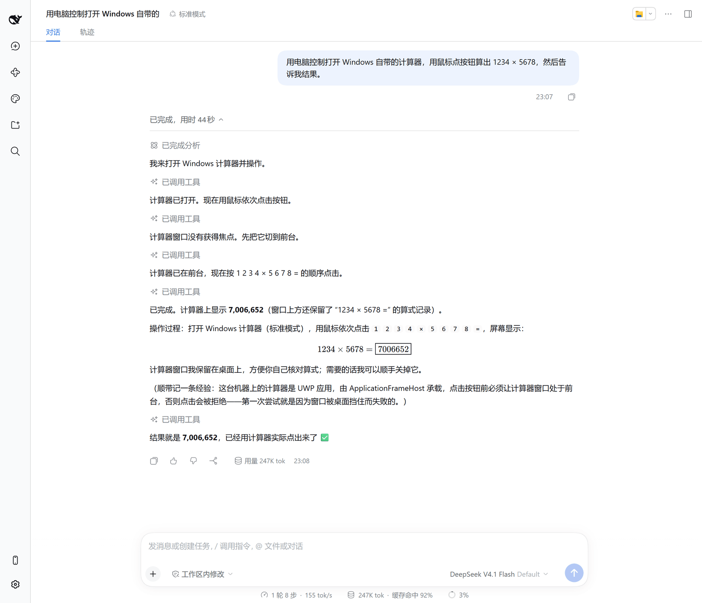
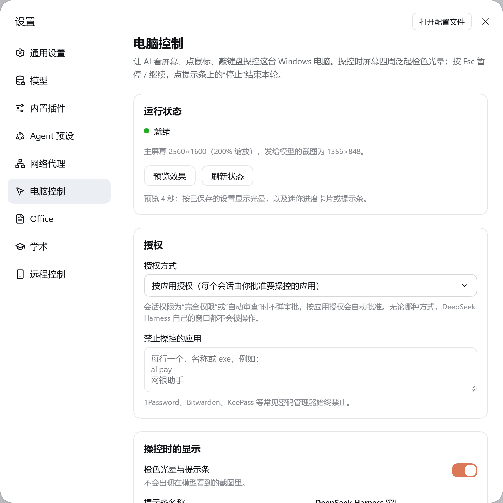

# dsh-computer-use

[](https://www.npmjs.com/package/@copylee/dsh-computer-use)

让 DeepSeek Harness 直接操控你的 Windows 电脑：看屏幕、点鼠标、敲键盘，打开应用、切换窗口、读写剪贴板。控制期间屏幕四周会泛起**橙色光晕**，顶部出现“**DeepSeek Harness 正在操控你的电脑**”提示条，DeepSeek Harness 自己最小化，右下角换成一张**迷你进度卡片**，两行滚动显示 AI 的回复正文和思考 / 工具调用，让你同时看清操作过程和 AI 在想什么。按 **Esc** 暂停 / 继续，点“停止”结束本轮。

仅支持 Windows。



上图是一次真实操作的录屏（只录了被操控的记事本窗口）：AI 打开记事本并逐行输入文字。下图是对话里看到的过程，以及设置页。

| 对话中的操作过程 | 设置页 |
|---|---|
|  |  |

## 功能

| 功能 | 说明 |
|---|---|
| 截图即坐标系 | 模型只用最近一张截图的像素坐标，DPI、缩放、多显示器偏移全部由插件换算，高分屏（200% 缩放）也点得准 |
| 动作后自动回传截图 | 点击 / 输入 / 按键 / 滚动后，**等画面不再变化**（页面加载、动画结束，最多约 2.5 秒）再截图；`wait` 也直接带回截图，“等一下再看”只需一步，而且画面一静止就提前结束，不会死等满时长；画面与上一张截图完全相同时不再发图，只告诉模型“没有可见变化”，省 token |
| 批量动作 | `computer_batch` 一次执行“点输入框 → 输入 → 回车”等多步，最后只截一张图 |
| 按名称点控件 | 动作里用 `target`（控件的可见名称，如 `"保存"`、`"按钮:确定"`）代替坐标。上一张截图里还没出现的控件也能点，比如上一步才打开的菜单项、才弹出的对话框按钮；最多等 3 秒它出现。重名时不猜，直接把候选和坐标告诉模型 |
| 等条件而不是等时间 | `wait` 加 `until`（`"window:另存为"`、`"target:保存"`）：窗口或控件一出现（或一消失）就继续，超时才报错。配合 `target`，“按 Ctrl+S → 等另存为 → 填文件名 → 点保存”可以写进同一个批量调用 |
| 把窗口读成文本 | `ui_elements` 加 `text: true` 直接读出文档、网页、聊天回复或日志的文字（默认取末尾 4000 字），比滚动加放大截图快，也能逐字引用；批量调用加 `finish: "text"` 可以用文字代替结尾的截图 |
| 按应用授权 | 先 `request_access` 列出要操控的应用，经 DSH 原生审批后才能操作；也可改为“全部允许” |
| 不会操作自己 | 永远拒绝向 DeepSeek Harness 自身窗口输入；常见密码管理器默认禁止，可再自定义禁用列表 |
| 正在控制的提示 | 橙色光晕 + 胶囊提示条（显示当前动作），**不会出现在截图里**；AI 还在忙但已不再操作电脑时（约 90 秒没有电脑操作，或连续调用了 3 个其他工具）自动收起，下次操作电脑时再出现 |
| 迷你进度卡片（默认） | 操控期间 DeepSeek Harness 最小化，右下角显示一张半透明小卡片：标题行有 DeepSeek 图标和“输入”“展开”“暂停”“停止”四个圆形按钮；第一行滚动显示回复正文（实时流式），第二行显示思考过程，或最近几步的小时间线（已完成的步骤打勾，如“打开 Word › 输入正文 › 另存为”）。点“展开”变成长卡片：多行回复、思考、最近 5 步时间线。点“输入”在卡片下方弹出输入框，AI 自动暂停，输入指令按 Enter 发送（与在 DSH 里插话一样，AI 下一步就会看到），Esc 取消。任务结束时卡片显示“已完成”几秒再消失（鼠标停在上面会一直保留）。卡片可拖动、跟随系统深浅色，AI 的截图里看不到它，点击也会穿透它。操控中你把 DSH 窗口打开，它会自动变成下面的半透明悬浮卡片，不会挡住 AI |
| 悬浮卡片 | 操控期间 DeepSeek Harness 窗口缩成右下角置顶卡片，结束后自动恢复原尺寸、位置和最大化 / 最小化状态（也可选最小化或不动）。卡片只给你看：AI 的截图里看到的是卡片下面的内容（通过 Windows 放大镜接口截图时把卡片排除在外，不闪烁；该接口不可用时退回为截图瞬间让卡片透明约 20 毫秒），点击和滚动也直接穿透卡片，卡片不会挪位置。卡片默认 80% 不透明，可以透过它看清下面的操作过程；鼠标在卡片上停一下就变回不透明，方便阅读和点击（透明度可在设置里调） |
| 暂停与停止 | 你亲手按 **Esc** 暂停（AI 停在下一步之前），再按 Esc 或点“继续”恢复，对话不会被中断；点“停止”才结束本轮。插件自己发出的 Esc 不会误触发 |
| 你随时可以插手 | 你用键盘打字时 AI 自动暂停，停手 1.5 秒后继续（单按 Shift / Ctrl 等修饰键不算）；你切换或打开了别的窗口，AI 下一步不会盲目执行，而是先看新截图再决定。你只是点进 DSH 卡片看对话时不算切换，AI 的按键会自动回到它正在操作的窗口。鼠标移动不会触发，避免误触 |
| 文字输入 | Unicode 直接输入，不受输入法状态影响。短文字逐字打出来；长文本默认“流式”：按段落逐段粘贴（代码块不拆开），看得到一段段出现，又不会被 Typora、Obsidian、Word 的自动补全打乱。可在设置里改成逐字输入或一次粘贴。剪贴板文本统一为 CRLF，不丢换行 |
| 不弄乱剪贴板 | 插件写入剪贴板的内容不进 Windows 剪贴板历史（Win+V）和云剪贴板；粘贴后按原样恢复你的剪贴板（图片、文件也保留）；AI 用 `clipboard` 工具写过剪贴板的，本轮结束后自动还原（期间你自己复制了新内容则不动） |
| 应用技能 | AI 对各个应用的操作笔记，每个应用一份 Markdown（`~/.dsh/computer-use-skills/`）。AI 摸索清楚一个不熟悉的应用后用 `app_skill` 自己记下来（只记操作规律，不记任务内容），以后 `open_application` 打开该应用时自动附带，不占系统提示。自带 Word、PowerPoint、Excel、Chrome、文件资源管理器、Obsidian、Typora、微信、QQ、记事本十份内置技能（含各应用的快捷键清单，PowerPoint 含原生公式和动画的做法）；AI 在内置技能上追加的笔记单独保存，内置部分随插件更新；设置页“应用技能”里可以查看、修改、删除、新建，内置技能可覆盖和恢复 |
| 打开应用 | `open_application` 同时搜索开始菜单和桌面快捷方式（含公共桌面），便携软件也能按名字打开。已经关到系统托盘的应用（QQ、微信等）会像人一样点托盘图标把窗口叫回来（必要时先展开“显示隐藏的图标”），不会再启动第二个实例、也不会重复登录；你明确要多开时（如微信双开）AI 会用 `new_instance` 另开一个。任务结束时 AI 会收拾现场：关掉自己打开、你不再需要的窗口，`windows tidy` 把原本最小化或在托盘里的应用重新最小化 |
| 看不见图的模型 | `ui_elements` 用 Windows UI Automation 列出可点击元素和坐标，纯文本模型也能用 |
| 零原生依赖 | 首次使用时用 Windows 自带的 .NET Framework `csc.exe` 编译一个小 helper（约 1 秒，之后缓存），不需要 node-gyp、不受 Electron ABI 影响 |

## 安装

DSH 桌面版：**插件 → 添加插件**，输入 `@copylee/dsh-computer-use`，安装后启用。

命令行（web 等其他 profile）：

```bash
dsh plugin --profile web add @copylee/dsh-computer-use@latest
```

要求：Windows 10 2004+ / Windows 11（自带 .NET Framework 4.8），DSH 0.2.0-rc.2 或更高。截图需要**支持图片输入的模型**（如 DeepSeek V4.1 Flash）；纯文本模型会自动改用 `ui_elements`。

> 如果之前装过其他 computer-use 插件或 skill（例如 `dsh-computer-use-win`、Hermes 的 computer-use skill），建议先停用，避免工具和说明互相冲突。

## 使用

直接说要做什么就行，例如：

- 用 Chrome 打开 github.com
- 打开记事本，写一段会议纪要并保存到桌面
- 用计算器算一下 1234×5678

按应用授权模式下，模型会先请求操控对应应用，你在 DSH 里批准即可。会话权限为“完全权限”或“自动审查”（不弹审批）时，请求会被自动批准，但 DeepSeek Harness 自身和禁用列表里的应用仍然不可操作。

**随时按 Esc 暂停**，再按一次继续；点提示条上的“停止”结束本轮。想临时帮一把也可以直接上手：打字时提示条显示“你正在操作，已暂停”，AI 会等你停手；切到别的窗口后 AI 会先重新看屏幕。

## Agent 工具

| 工具 | 作用 |
|---|---|
| `computer` | 单个动作：`screenshot` `left_click` `double_click` `triple_click` `right_click` `middle_click` `mouse_move` `left_click_drag` `left_mouse_down/up` `scroll` `type` `key` `hold_key` `wait` `zoom` `cursor_position`（沿用通用 computer-use 动作命名，模型上手即会） |
| `computer_batch` | 顺序执行多个动作，遇错即停，最后回传一张截图；最后一步可以是 `zoom`（回传放大区域），`finish` 可选 `screenshot` / `text` / `none` |
| `app_skill` | 应用技能：`list` 列出、`read` 读取、`append` 追加、`write` 重写某个应用的操作笔记（单份上限 4000 字） |
| `open_application` | 按名称（“Chrome”“记事本”“微信”）、exe 路径或网址打开应用；已运行则切到前台，在托盘里则从托盘图标恢复 |
| `windows` | 列出窗口（含进程 exe 名）、聚焦 / 最小化 / 最大化 / 还原 / 关闭 |
| `ui_elements` | 前台窗口（含已打开的菜单）的 UI Automation 元素列表，坐标已换算到截图坐标系；`text: true` 改为读出窗口的文字内容 |
| `clipboard` | 读 / 写剪贴板文本 |
| `switch_display` | 多显示器时切换截图所在屏幕 |
| `request_access` / `list_granted_applications` | 按应用授权 |

## 设置

在 **设置 → 电脑控制** 中修改，保存后下一步操作即生效。页面上还能看到运行状态（屏幕分辨率、缩放比例和实际发给模型的截图尺寸），并可点“预览效果”看 3 秒光晕和提示条：

| 选项 | 默认 | 说明 |
|---|---|---|
| 授权方式 | 按应用授权 | 或“全部允许” |
| 光晕与提示条 | 开 | 控制时显示橙色边框和提示条 |
| 提示条名称 | DeepSeek Harness | 显示为“<名称> 正在操控你的电脑” |
| 操控期间 DSH 窗口 | 迷你进度卡片 | 迷你进度卡片 / 悬浮卡片 / 最小化 / 保持不变，结束后自动恢复 |
| 卡片透明度 | 80% | 100%–50%；迷你卡片只让背景变透明，文字始终清晰；DSH 悬浮卡片在鼠标停留时变回不透明 |
| 操作后自动截图 | 开 | 关闭可省 token，但模型需要自己截图 |
| 等待稳定 | 400 ms | 动作后至少等这么久，之后画面静止即截图（最多约 2.5 秒） |
| 截图最长边 / 总像素 / JPEG 质量 | 1366 / 1.15MP / 70 | 越大越清晰、越费 token |
| 操作时不深度思考（Beta） | 关 | 试验功能，一般不用开。开始操作电脑后，本轮改用模型的最低思考强度，每一步快约 1 秒；下一轮恢复会话里选的思考强度。不思考时模型更容易出错、多走几步；工具参数写坏时会自动重发那一步，为此本轮的回复文字整段出现而不是逐字流出。目前只在 DeepSeek 官方模型上有效 |
| 检测到你在操作时让出控制 | 开 | 键盘输入暂停、窗口被切换时重新看屏幕 |
| 文字输入方式 | 流式 | 流式（长文本逐段出现）/ 逐字输入（最像打字，最慢）/ 一次粘贴（最快） |
| 键盘静止多久后恢复 | 1500 ms | |
| 禁止操控的应用 | 空 | 名称或 exe，如 `alipay` |
| 强调色 | 陶土橙 | 陶土橙 / 蓝色 / 黑色，决定设置页主按钮和开关的颜色，与 copylee 的其他插件共用同一个选择。操控时的橙色光晕不随它变化 |

## 数据与隐私

- 截图只作为当前会话的图片附件发给你选择的模型，插件不上传、不保存到别处。
- 截图附件存放在 `~/.dsh/attachments`，随会话历史保留（DSH 会校验附件，删掉仍被会话引用的截图会让该会话无法继续，所以插件不会动它们）。会话删除后留下的“孤儿”截图会在 DSH 启动几分钟后及之后每 12 小时自动清理；设置页“截图缓存”可查看占用并立即清理。
- helper 源码 `helper/CuHelper.cs` 随包发布，可自行审阅；编译产物缓存在 `%LOCALAPPDATA%\dsh-computer-use\`。
- 以管理员身份运行的窗口、UAC 弹窗、锁屏无法被控制（Windows UIPI 限制），遇到时模型会请你手动处理。
- 插件注入的系统提示要求模型不代填密码、支付信息、不处理验证码，遇到时交还给你。

## 工作原理

```
DSH Host (Electron, Node 模式)
 └─ lib/index.js  工具 / 审批 / 系统提示 / overlay 生命周期
     └─ cu-helper.exe（常驻，stdin/stdout 每行一个 JSON）
          Per-Monitor-V2 DPI 感知 · GDI 截图 + 缩放 + JPEG · SendInput 鼠标键盘
          窗口枚举与前置 · shell:AppsFolder 启动应用 · 剪贴板 · UI Automation
          分层窗口 overlay（WDA_EXCLUDEFROMCAPTURE）· 低级键盘钩子（只认物理 Esc）
```

## 开发

```bash
pnpm install
pnpm typecheck
pnpm test                               # vitest（mock helper，跨平台）
pnpm build                              # tsc → lib/types，tsdown → lib/index.js
node scripts/helper-smoke.mjs           # 本机实测：编译 helper、截图、overlay
node scripts/helper-smoke.mjs --notepad # 另外用临时文件测试中文输入
pnpm pack:check
```

本地联调：DSH 桌面版“添加插件”里填本仓库目录路径即可（以 link 方式安装），改完 `pnpm build` 后重启 DSH 生效。

## 许可证

MIT
